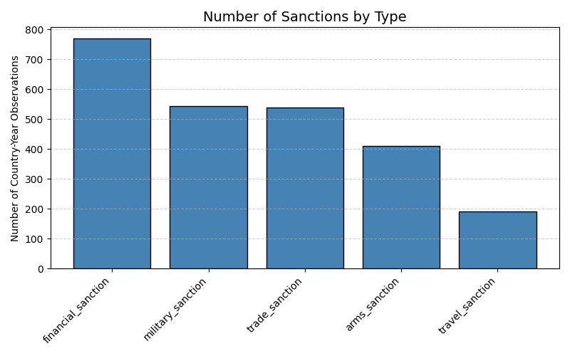
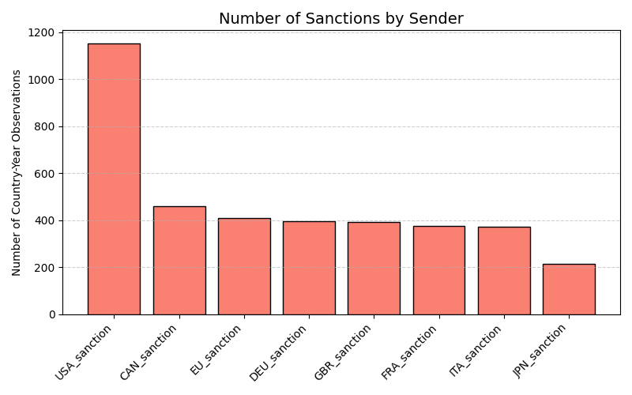
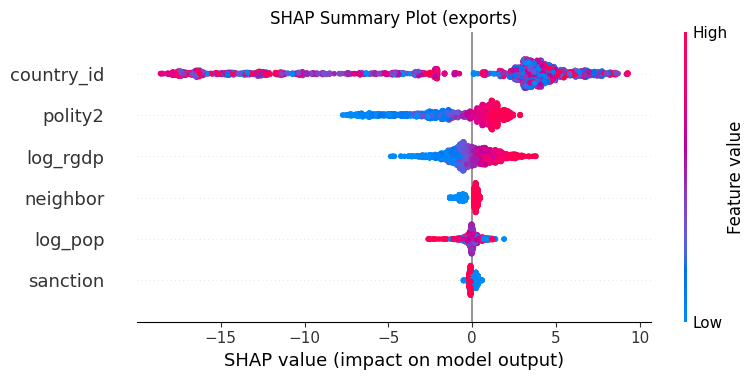
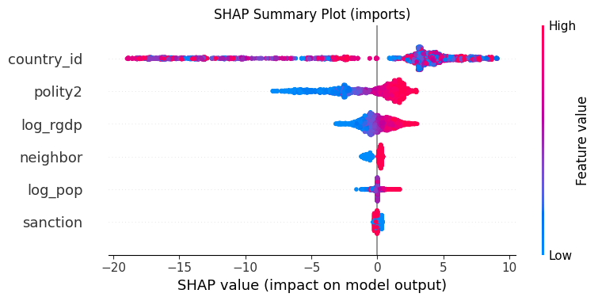

# Sanctions and Trade: Direct and Spillover Effects

International sanctions can be interpreted as shocks that increase trade costs, as targeted countries face restrictions on exporting to or importing from certain partners. Moreover, the impact of sanctions is not confined to the targeted economy alone. Neighboring countries that share land borders with sanctioned states may also be affected through two main channels. First, sanctions may disrupt regional trade routes or increase transportation and compliance costs, thereby reducing trade flows(Kaempfer and Lowenberg, 2007). Second, these neighbors may benefit from trade diversion, as sanctioned countries reroute their demand or supply through nearby markets (Crozet et al.,2021). 

Numerous studies have examined the impact of sanctions on targeted countries (Yang et al., 2009; Haidar, 2017; Gharehgozli, 2017). Overall, the existing literature consistently finds that most sanctions significantly reduce the economic activities of the sanctioned states. However, the potential spillover effects of sanctions on neighboring countries have received far less attention. Neighbors that share land borders with sanctioned states may be affected through two main channels. On one hand, sanctions can disrupt regional trade routes or increase transportation and compliance costs, thereby reducing overall trade flows. On the other hand, neighboring economies may benefit from trade diversion, as sanctioned countries redirect their trade through nearby markets to bypass restrictions.

Recently, Vincenzo et al. (2023) employed panel data to estimate the impact of sanctions on land-bordering countries that are not themselves subject to any sanction regime. Their findings indicate that sanctions can generate measurable indirect effects on neighboring economies, highlighting the regional dimension of sanction policies. Building on this approach, our study also uses panel data to estimate both the direct effects of sanctions on targeted countries and the spillover effects on their neighbors. Despite the growing attention, the broader mechanisms underlying these spillovers—such as heterogeneity across sanction types, sender countries, and economic linkages—remain relatively underexplored, motivating our analysis.


## Research Question
This project explores how international sanctions influence trade, both for targeted countries and their land neighbors.  
The central questions are:

1. Do sanctions reduce trade (imports and exports) of the targeted countries?  
2. Do neighboring countries experience positive spillover effects by capturing trade flows diverted from sanctioned nations?

The working hypothesis is that sanctions impose negative trade shocks on targeted economies, while neighboring countries may partially benefit through redirected trade and substitution effects.

---
## Data and Cleaning Process

We use a panel dataset covering 72 countries over 44 years, from 1975 to 2018, to analyze the direct and spillover effects of sanctions on trade. Our main dependent variables are the logarithms of unilateral imports and exports, obtained annually from the World Bank Development Indicators. A sanctioned country is defined as one subject to at least one type of sanction. Neighboring countries are defined based on first-order contiguity, meaning a country must share a land border with at least one sanctioned country. We also include control variables such as GDP, population, and polity scores to account for economic size and political characteristics.

The dataset includes 2,590 observations. Approximately 48.0% of observations are subject to at least one sanction, 72.1% have at least one neighboring country under sanction, and 40.2% experience both conditions simultaneously, highlighting the importance of studying both direct and spillover effects of sanctions.

### Number of Sanctions by Type


### Number of Sanctions by Sender


- **Data Source:** Multiple international datasets combining trade, macroeconomic, and political indicators (1975–2019).  
- **Unit of Analysis:** Country–year observations.

### Key Variables
| Variable | Description |
|-----------|--------------|
| `sanction` | 1 if the country is under any sanction (TRADE, ARMS, MILITARY, FINANCIAL, or TRAVEL) |
| `neighbor` | 1 if at least one of its land neighbors is under sanction |
| `log_import` | Log of total imports from the rest of the world |
| `log_export` | Log of total exports to the rest of the world |
| `log_gdp` | Log of GDP |
| `log_pop` | Log of population |
| `polity` | Political regime index |

### Cleaning Steps
1. **Merge and harmonize** country identifiers across datasets.  
2. **Filter** observations from **1975–2019** to ensure data consistency.  
3. **Log-transform** import, export, GDP, and population to handle scale differences and heteroskedasticity.  
4. **Generate dummy variables** for `sanction` and `neighbor`.  
5. **Remove missing or inconsistent entries** to ensure balanced panel data.  
6. Validate that each country has both sanctioned and non-sanctioned periods to enable within-country comparisons.


### 📊 Summary Statistics

| Variable         | Count | Mean     | Std     | Min    | 25%    | 50%    | 75%    | Max    |
|------------------|--------|----------|---------|--------|--------|--------|--------|--------|
| log_imports_gdp  | 2590   | 3.2680   | 1.0088  | 0.0000 | 3.0910 | 3.4340 | 3.8501 | 5.2575 |
| log_imports      | 2590   | 17.5317  | 10.1839 | 0.0000 | 18.3590| 22.6202| 24.1617| 28.3258|
| log_exports      | 2590   | 17.4262  | 10.1466 | 0.0000 | 17.4766| 22.4207| 24.1375| 28.4906|
| log_exports_gdp  | 2590   | 3.0948   | 1.0365  | 0.0000 | 2.7081 | 3.2581 | 3.7377 | 5.2883 |
| polity2          | 2590   | 2.2008   | 7.1122  | -10.0000| -6.0000| 5.0000 | 9.0000 | 10.0000|
| sanction         | 2590   | 0.4803   | 0.4997  | 0.0000 | 0.0000 | 0.0000 | 1.0000 | 1.0000 |
| neighbor         | 2590   | 0.7212   | 0.4485  | 0.0000 | 0.0000 | 1.0000 | 1.0000 | 1.0000 |
| log_rgdp         | 2590   | 24.2945  | 1.9569  | 19.7983| 22.9101| 24.1489| 25.9109| 30.2332|
| log_gdppc        | 2590   | 8.2533   | 1.3091  | 5.2535 | 7.2275 | 8.2037 | 9.0101 | 11.6300|
| log_pop          | 2590   | 16.0469  | 1.7344  | 12.7018| 14.9416| 16.0844| 17.0865| 21.0617|


## Conceptual framework

To estimate the direct and spillover effects of sanctions on trade, we specify the following panel regression model (following Vincenzo et al.,2023):

```math
Trade_{it} = alpha + beta_1 * Sanction_{it} + beta_2 * Neighbor_{it} + gamma * X_{it} + mu_i + lambda_t + epsilon_{it},
```
where `Trade_{it}` denotes the unilateral trade outcome of country i in year t, measured as the log of imports, exports. `Sanction_{it}` is a dummy variable equal to 1 if country i is subject to at least one sanction—financial, military, trade, arms, or travel—in year t, and 0 otherwise. `Neighbor_{it}` is a dummy variable equal to 1 if at least one land-border neighbor of country i is under sanction in year t, and 0 otherwise. `X_{it}` is a vector of control variables capturing economic size and other characteristics, such as log GDP, log population, and polity score. `mu_i` and `lambda_t` represent country and year fixed effects, respectively, controlling for time-invariant country characteristics and global shocks common to all countries in a given year. Finally, `epsilon_{it}` is the error term. In this specification, `beta_1` captures the direct impact of sanctions on the targeted country, while `beta_2` captures the spillover effect on neighboring countries, reflecting potential trade diversion or regional disruption, in otheword benefit or lost to the neighboring.


---

## Research Method

### 1. Baseline OLS Regression
A linear model is estimated to identify the direct and indirect (neighbor) effects of sanctions on trade:

\[
\text{log\_trade}_{it} = \alpha + \beta_1 \text{sanction}_{it} + \beta_2 \text{neighbor}_{it}
+ \beta_3 \text{log\_gdp}_{it} + \beta_4 \text{log\_pop}_{it} + \beta_5 \text{polity}_{it} + \epsilon_{it}
\]

Separate regressions are run for both **imports** and **exports**.

### 2. Machine Learning Analysis
To capture **nonlinearities** and **heterogeneous treatment effects**:
- The dataset is **split into training and testing sets**, ensuring each country has both `sanction = 0` and `sanction = 1` periods in both sets.  
- ANN model is trained on trade outcomes.  
- **SHAP values** are calculated to interpret model predictions and identify which variables most influence trade changes under sanctions.

---

## Main Findings

1. **Negative Effect on Targeted Countries:**  
   Sanctions significantly reduce both imports and exports, confirming the expected trade-restrictive impact.

2. **Positive Spillover to Neighbors:**  
   Neighboring countries experience increased trade flows, suggesting **trade diversion** as global partners redirect economic activity toward non-sanctioned markets.

3. **Robustness Across Models:**  
   Both OLS and ML–SHAP analyses consistently show these effects.

## OLS Regression Results

<pre><code>
Dependent var: log_imports
                            OLS Regression Results                            
==============================================================================
Dep. Variable:            log_imports   R-squared:                       0.835
Model:                            OLS   Adj. R-squared:                  0.827
Method:                 Least Squares   F-statistic:                     524.7
Date:                Sun, 19 Oct 2025   Prob (F-statistic):               0.00
Time:                        18:45:25   Log-Likelihood:                -7354.5
No. Observations:                2590   AIC:                         1.495e+04
Df Residuals:                    2470   BIC:                         1.565e+04
Df Model:                         119                                         
Covariance Type:                  HC3                                         
====================================================================================
                       coef    std err          z      P>|z|      [0.025      0.975]
------------------------------------------------------------------------------------
Intercept          -41.0838     16.560     -2.481      0.013     -73.541      -8.627
sanction            -1.0513      0.282     -3.734      0.000      -1.603      -0.499
neighbor             0.9986      0.294      3.395      0.001       0.422       1.575
log_rgdp             1.1047      0.509      2.171      0.030       0.108       2.102
log_pop              0.7031      0.990      0.710      0.478      -1.237       2.644
polity2              0.1468      0.033      4.481      0.000       0.083       0.211
==============================================================================
Omnibus:                      312.266   Durbin-Watson:                   0.380
Prob(Omnibus):                  0.000   Jarque-Bera (JB):             2580.445
Skew:                           0.253   Prob(JB):                         0.00
Kurtosis:                       7.864   Cond. No.                     7.14e+03
==============================================================================

Notes:
[1] Standard Errors are heteroscedasticity robust (HC3)
[2] The condition number is large, 7.14e+03. This might indicate that there are
strong multicollinearity or other numerical problems.
</code></pre>

<pre><code>
Dependent var: log_exports
                            OLS Regression Results                            
==============================================================================
Dep. Variable:            log_exports   R-squared:                       0.837
Model:                            OLS   Adj. R-squared:                  0.829
Method:                 Least Squares   F-statistic:                     533.8
Date:                Sun, 19 Oct 2025   Prob (F-statistic):               0.00
Time:                        18:45:25   Log-Likelihood:                -7330.4
No. Observations:                2590   AIC:                         1.490e+04
Df Residuals:                    2470   BIC:                         1.560e+04
Df Model:                         119                                         
Covariance Type:                  HC3                                         
====================================================================================
                       coef    std err          z      P>|z|      [0.025      0.975]
------------------------------------------------------------------------------------
Intercept          -46.1232     16.358     -2.820      0.005     -78.183     -14.063
sanction            -1.0459      0.278     -3.762      0.000      -1.591      -0.501
neighbor             1.0336      0.292      3.541      0.000       0.461       1.606
log_rgdp             1.2662      0.509      2.490      0.013       0.269       2.263
log_pop              0.7829      0.983      0.796      0.426      -1.144       2.709
polity2              0.1416      0.032      4.374      0.000       0.078       0.205
==============================================================================
Omnibus:                      317.842   Durbin-Watson:                   0.381
Prob(Omnibus):                  0.000   Jarque-Bera (JB):             2660.094
Skew:                           0.264   Prob(JB):                         0.00
Kurtosis:                       7.937   Cond. No.                     7.14e+03
==============================================================================

Notes:
[1] Standard Errors are heteroscedasticity robust (HC3)
[2] The condition number is large, 7.14e+03. This might indicate that there are
strong multicollinearity or other numerical problems.
</code></pre>
git pull origin main --rebase

ML result


## SHAP Results

Here are the main SHAP visualizations:

### Summary Plot for Export


### Summary Plot for Import


### Relationship Direction
This table show the impact of sanction on the targeted country ("sanction") and their land neighbor ("neighbor") import and export. The gifure shows that sanction positively impacts on the land neighbor and negatively impacts on the targeted country in term of trade.


## Heterosgeneous impact

Sanctions consistently reduce exports of the targeted countries. Among the different types, financial and trade sanctions have the strongest negative effects, reflecting their direct disruption of economic and commercial activities. 

The effects on neighboring countries are more nuanced. Neighboring countries can experience both positive and negative impacts depending on the type of sanction and the sender. For example, military and financial sanctions often generate spillover benefits for neighboring nations, while travel sanction may create disruptions.

The United States, as a large economic power, exerts the highest marginal impact on target exports compared to other senders. This highlights that the economic weight of the sender plays a significant role in amplifying the effect of sanctions, although the type of sanction and regional dynamics also matter.

### Impact of Sanctions on Imports Of the target and Neighboring

| sanction_type | count | mean_shap_sanction | mean_shap_neighbor |
|---|---|---|---|
| arms_sanction | 2055 | -0.097705 | 0.000589 |
| financial_sanction | 3845 | -0.102344 | 0.077659 |
| military_sanction | 2715 | -0.092903 | 0.132733 |
| trade_sanction | 2690 | -0.100229 | 0.030465 |
| travel_sanction | 950 | -0.097838 | -0.061476 |


### Impact of Sanctions on Imports Of the target and Neighboring by sanction sender

| sanction_type | count | mean_shap_sanction | mean_shap_neighbor |
|---------------|-------|------------------|------------------|
| CAN_sanction  | 2290  | -0.098819        | 0.135576         |
| DEU_sanction  | 1985  | -0.096510        | 0.109663         |
| EU_sanction   | 2050  | -0.096875        | 0.111950         |
| FRA_sanction  | 1880  | -0.095147        | 0.111764         |
| GBR_sanction  | 1965  | -0.096030        | 0.115086         |
| ITA_sanction  | 1860  | -0.094894        | 0.112465         |
| JPN_sanction  | 1065  | -0.097476        | 0.075173         |
| USA_sanction  | 5755  | -0.099955        | 0.086282         |

### Impact of Sanctions on Exports Of the target and Neighboring by sanction type

| sanction_type     | count | mean_shap_sanction | mean_shap_neighbor |
|------------------|-------|------------------|------------------|
| arms_sanction     | 2055  | -0.066753        | -0.005502        |
| financial_sanction| 3845  | -0.069448        | 0.064068         |
| military_sanction | 2715  | -0.064162        | 0.116413         |
| trade_sanction    | 2690  | -0.067301        | 0.026802         |
| travel_sanction   | 950   | -0.065298        | -0.057268        |

### Impact of Sanctions on Exports Of the target and Neighboring by sanction sender

| sanction_type  | count | mean_shap_sanction | mean_shap_neighbor |
|----------------|-------|------------------|------------------|
| CAN_sanction   | 2290  | -0.067086        | 0.120200         |
| DEU_sanction   | 1985  | -0.067442        | 0.095745         |
| EU_sanction    | 2050  | -0.067558        | 0.097706         |
| FRA_sanction   | 1880  | -0.067138        | 0.097787         |
| GBR_sanction   | 1965  | -0.067316        | 0.100839         |
| ITA_sanction   | 1860  | -0.067009        | 0.098590         |
| JPN_sanction   | 1065  | -0.066569        | 0.066425         |
| USA_sanction   | 5755  | -0.068409        | 0.072539         |
