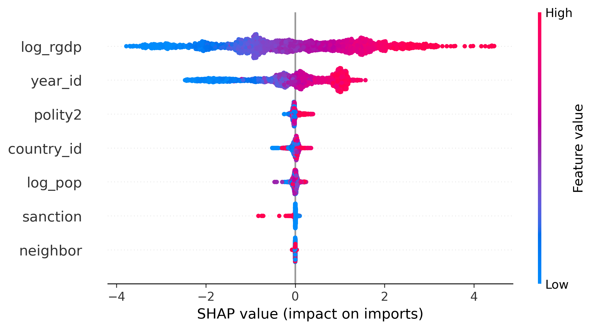
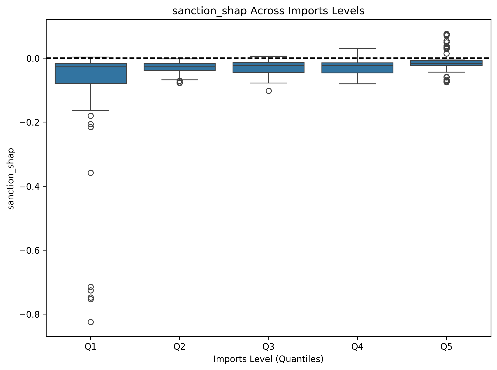
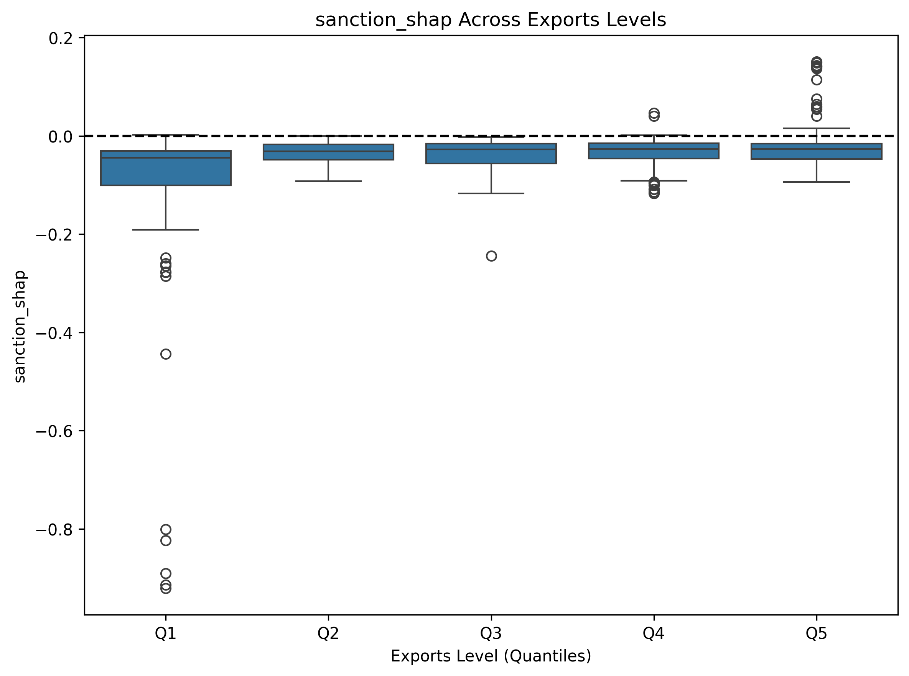
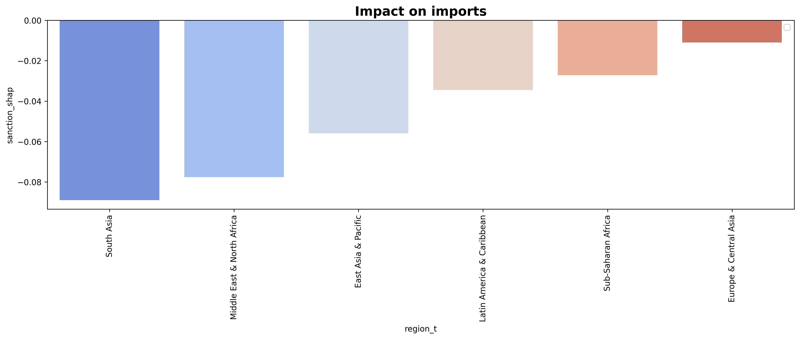
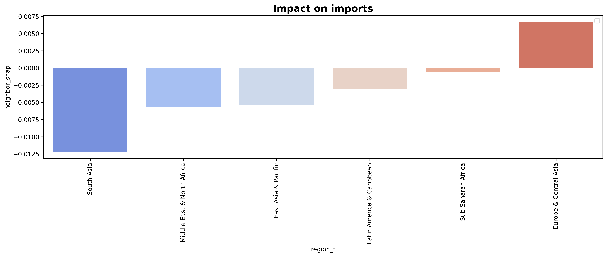

# Sanctions and Trade: Direct and Spillover Effects

This paper examines the direct and spillover effects of economic sanctions on international trade. Using a panel of 72 countries over the period 1975–2018, we analyze how sanctions imposed by major economies affect both targeted states and their neighbors. To capture nonlinear and heterogeneous responses, we employ a Random Forest model complemented by Shapley value (SHAP) decompositions, which allow us to quantify the contribution of sanctions across different country characteristics.
We find that sanctions significantly reduce trade in targeted countries, with stronger effects in low-income, trade-dependent economies and regions such as South Asia and the Middle East and North Africa, and increasing in magnitude with trade intensity. While average spillover effects on neighboring countries are close to zero, conditioning on exposure reveals negative impacts for middle-income countries with strong cross-border linkages and modest positive effects for high-income countries, consistent with trade diversion. Overall, sanctions extend beyond their targets, generating heterogeneous spillovers that impact neighbors depending on their geographic and economic connections.

## Research Question
This project explores how international sanctions influence trade, both for targeted countries and their land neighbors.  
The central questions are:

1. Do sanctions reduce trade (imports and exports) of the targeted countries?  
2. Do neighboring countries experience positive spillover effects by capturing trade flows diverted from sanctioned nations?

The working hypothesis is that sanctions impose negative trade shocks on targeted economies, while neighboring countries may partially benefit through redirected trade and substitution effects.

---
## Data and Cleaning Process


- **Data Source:** Multiple international datasets combining trade, macroeconomic, and political indicators (1975–2018).  We use non-universal sanctions which are not mandatory to all countries who are members as UN sanctions.
- **Unit of Analysis:** Country–year observations.

### Key Variables
| Variable | Description |
|-----------|--------------|
| `sanction` | 1 if the country is under trade sanctions (United States, the European Union, the United Kingdom, Germany, France, Italy, Canada, and Japan)
| `neighbor` | 1 if at least one of its land neighbors is under sanction |
| `log_import` | Log of total imports from the rest of the world |
| `log_export` | Log of total exports to the rest of the world |
| `log_gdp` | Log of GDP |
| `log_pop` | Log of population |
| `polity` | Political regime index |

### Cleaning Steps
 **Filter** observations from **1975–2019** to ensure data consistency.  
**Log-transform** import, export, GDP, and population to handle scale differences and heteroskedasticity.  
**Generate dummy variables** for `sanction` and `neighbor`.  
**Remove missing or inconsistent entries** to ensure balanced panel data.  


### 📊 Summary Statistics

| Variable     | Count | Mean   | Std   | Min    | 25%    | 50%    | 75%    | Max    |
|--------------|--------|--------|-------|--------|--------|--------|--------|--------|
| log_imports  | 3012   | 22.482 | 2.045 | 14.430 | 21.072 | 22.546 | 23.878 | 28.573 |
| log_exports  | 3012   | 22.292 | 2.227 | 13.449 | 20.731 | 22.296 | 23.872 | 28.608 |
| sanction     | 3012   | 0.176  | 0.381 | 0.000  | 0.000  | 0.000  | 0.000  | 1.000  |
| neighbor     | 3012   | 0.338  | 0.473 | 0.000  | 0.000  | 0.000  | 1.000  | 1.000  |
| log_rgdp     | 3012   | 24.402 | 1.820 | 19.351 | 23.137 | 24.321 | 25.839 | 30.233 |
| log_pop      | 3012   | 3.807  | 1.189 | 0.423  | 2.947  | 3.863  | 4.618  | 7.136  |
| polity       | 3012   | 1.266  | 7.055 | -10.000| -7.000 | 4.000  | 8.000  | 10.000 |


## Conceptual framework

To estimate the direct and spillover effects of sanctions on trade, we specify the following panel regression model (following Vincenzo et al.,2023):

```math
Trade_{it} = alpha + beta_1 * Sanction_{it} + beta_2 * Neighbor_{it} + gamma * X_{it} + mu_i + lambda_t + epsilon_{it},
```
where `Trade_{it}` denotes the unilateral trade outcome of country i in year t, measured as the log of imports, exports. `Sanction_{it}` is a dummy variable equal to 1 if country i is subject to at least one sanction—financial, military, trade, arms, or travel—in year t, and 0 otherwise. `Neighbor_{it}` is a dummy variable equal to 1 if at least one land-border neighbor of country i is under sanction in year t, and 0 otherwise. `X_{it}` is a vector of control variables capturing economic size and other characteristics, such as log GDP, log population, and polity score. `mu_i` and `lambda_t` represent country and year fixed effects, respectively, controlling for time-invariant country characteristics and global shocks common to all countries in a given year. Finally, `epsilon_{it}` is the error term. In this specification, `beta_1` captures the direct impact of sanctions on the targeted country, while `beta_2` captures the spillover effect on neighboring countries, reflecting potential trade diversion or regional disruption, in otheword benefit or lost to the neighboring.


---

## Research Method

### 1. Baseline OLS Regression


OLS Regression Results for Imports and Exports
---------------------------------------------------------
Variable         | (1) Import | (2) Export
-----------------|------------|------------
Sanction         | -0.161***  | -0.160***
                 | (0.027)    | (0.029)
Neighbor         | -0.039*    | -0.039
                 | (0.023)    | (0.025)
Log RGDP         | 1.174***   | 1.492***
                 | (0.031)    | (0.034)
Log Population   | -0.566***  | -0.863***
                 | (0.063)    | (0.069)
Polity2          | 0.011***   | 0.012***
                 | (0.002)    | (0.002)
-----------------|------------|------------
Observations     | 3012       | 3012
Adjusted R²      | 0.953      | 0.952
---------------------------------------------------------
Notes:
- Robust standard errors in parentheses.
- Significance: *** p<0.01, ** p<0.05, * p<0.1


### 2. Machine Learning Analysis
To capture **nonlinearities** and **heterogeneous treatment effects**:
- The dataset is **split into training and testing sets**, ensuring each country has both `sanction = 0` and `sanction = 1` periods in both sets.  
- ANN model is trained on trade outcomes.  
- **SHAP values** are calculated to interpret model predictions and identify which variables most influence trade changes under sanctions.

---

## Main Findings

1. Sanctions significantly reduce trade in targeted countries, with effects that are highly heterogeneous across income levels, regions, and degrees of trade dependence. The negative impact is strongest in low-income and trade-dependent economies, particularly in South Asia and the Middle East and North Africa, while high-income countries exhibit greater resilience due to stronger institutions and diversified trade structures.

2. Spillover effects on neighboring countries are not uniform. Although the average effect is close to zero, this masks substantial heterogeneity: countries with strong exposure to sanctioned neighbors—especially middle-income economies—experience trade contractions, whereas high-income neighbors benefit modestly from trade diversion.

3. Overall, this study contributes by showing that sanctions do not operate uniformly but instead reshape trade patterns through heterogeneous direct and indirect channels. Beyond reducing trade in targeted states, sanctions reallocate trade across the broader network, generating both negative spillovers and diversion gains depending on countries’ economic structure and geographic exposure.


## SHAP Results

Here are the main SHAP visualizations:

### Summary Plot for Export


### Summary Plot for Import


## Heterosgeneous impact











